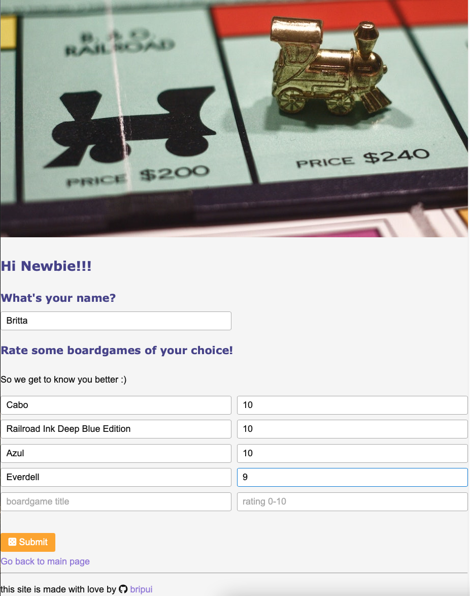
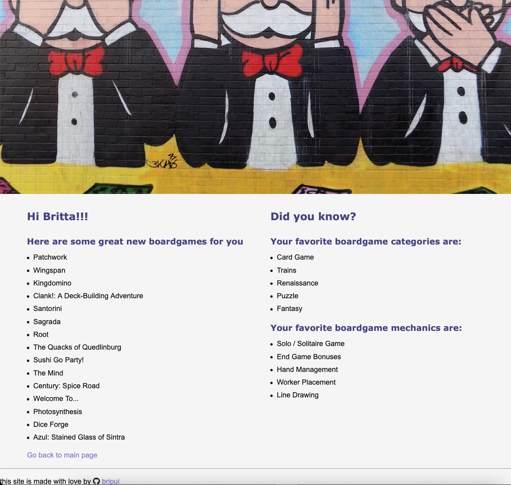

# board game recommender
## Overview

This project is about creating a recommender application for board games. The data is based on user ratings of https://boardgamegeek.com/wiki/page/BGG_XML_API2# BGG XML API2. The recommender uses the NMF algorithm of scikit-learn on the user-item-matrix of user ratings.

If you have an account on www.boardgamegeeks.com you can use your user name and get recommendation based on your ratings

If you have no account, you can rate up to 5 boardgames inside the application and you get recommendations based on this input.

## Features

### Scraper

API/Web Scraper for scraping board game information (ID, categories, mechanics and so on) and user ratings + comments

api_bgg_scraper.py : first version

api_bgg_scraper_2.0.py: improved for getting 100 board games in one reqeuest

clean_ratings.py: preparing and reducing data for user-item-matrix (removing users with <5 ratings, removing comments)

### Application

Local Flask Application

uses local data in csv format

### Web Application

Flask Application for deploying on heroku

uses data from my aws PostgreSQL data base

## Technology

pandas 

numpy

beautifulSoup

scikit-learn

SQLAlchemy

## Preview

